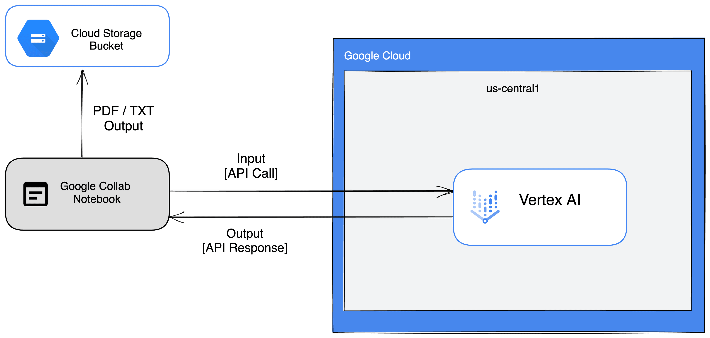

# Customer Scenario Simulator
This solution offers the opportunity to simulate customer scenarios, enabling you to practice and improve your customer service skills effectively. It generates personas and issues for realistic conversational roleplay with an AI chatbot, providing a valuable learning experience. Furthermore, it offers automated feedback on your performance, helping you track your progress and identify areas for improvement. All conversations can be saved as text or PDF files for future reference. Powered by VertexAI and responsible AI techniques, this solution ensures high-quality conversations.

# Domain & Concept Knowledge

## Use Cases

Customer engineers can simulate customer scenarios to gain experience on how to handle different types of requests. This can help them to provide better customer service and resolve issues more quickly in real-life situations. They also get to practice their communication and problem-solving skills in a low-stakes environment.

Seeing the value in practice simulations. I believe that developing a program for this particular use-case can:

- Provide valuable insights and support for a variety of customer scenarios in the cloud.
- Review best practices when interacting with customers. 
- Provide feedback to customer interactions in a learnable and low-stakes environment.

## Why Generative AI?

Generative will enable this simulator tool to generate text interactions that represent the different ways that a customer might interact with a business. It will also enable this tool to analyze any responses provided by the user and use that to generate actionable feedback.

## Problem Formulation

There are several initiatives within Google Cloud like RPG Arena and Pitch World Cup that provide customer engineers with the opportunity to role play customer interactions. However, these initiatives are not always scalable and tailored to the growth and development of an individual customer engineer in Google Cloud. Thus it is important to provide a solution that is personable and scalable for **_all customer engineers_**.

## Potential Risks & Mitigation

Since we cannot accurately predict what responses we will get from the model we used. There is a tendency for the model to produce outputs/feedback that is offensive, misleading or biased. 

Additionally, the model could generate scenarios that do not reflect a given scenario.

These risks will be carefully considered in the following ways:

- Provide an adequate amount of training examples to ensure responses are within a given context.
- Utilize prompt engineering techniques like few-shot prompting and other stop-gaps and guardrails that ensure a limited set of responses.  
- Incorporate a level of reinforcement learning to ensure outputs are accurate.

## Requirements

A customer engineer should be able to:

- Simulate how a customer would interact with a cloud business across different scenarios.
- React to these scenarios
- Receive feedback based on their responses. 
- Decipher best practices and patterns from these interactions.
- Share these best practices and patterns with other customer engineers.

# System Architecture

This solution will utilize a Google Collab Notebook that will send an API call to a VertexAI Generative Studio model. The model will then send a response back to the notebook. Additionally, the solution can save its responses in either a .pdf or .txt format in a Cloud Storage Bucket.

Within VertexAI, I will be utilizing ChatBison to interact with the customer and TextBison to provide feedback based on the conversation. 

# Design

The Customer Scenario Simulator is designed to automatically generate customer service scenarios and enable customer service agents to practice resolving issues through conversational chat.

## Key features

- Generate random customer personas and issues
- Chatbot powered conversations with the customer (ChatBison) 
- Automated feedback on agent's performance (TextBison)
- Save conversations as text files or PDFs
- Upload files to Cloud Storage

## Prompt Design Workflow

Here are the few-shot prompts that were used for each model:

| Model      | Prompt                                                                                                                                                                                                                                                                                                                                                                                               | Explanations                                                                                                                                                                                                                                                                                                                                                                                                                                       | Prompt Type      |
|------------|------------------------------------------------------------------------------------------------------------------------------------------------------------------------------------------------------------------------------------------------------------------------------------------------------------------------------------------------------------------------------------------------------|----------------------------------------------------------------------------------------------------------------------------------------------------------------------------------------------------------------------------------------------------------------------------------------------------------------------------------------------------------------------------------------------------------------------------------------------------|------------------|
| Chat Bison | You are a  `{selected_persona}`  customer and you are experiencing a problem related to  `{selected_area}`  on Google Cloud. \nWhen prompted, you will provide a detailed description of the problem you are facing, including any relevant context or issues you have encountered. \nPlease note that you should keep the dialogue brief but conversational and ask questions to solve your issue." | `{selected_persona}` is assigned from variable persona consisting of different personas:  `['impatient','dissatisfied','angry','frugal','clueless','defective object', 'feature request']`  `{selected_area}`is assigned from variable areas from variable areas  consisting of GCP topic areas:  `["Compute", "Storage", "Database", "Networking", "Big Data", "Machine Learning", "Internet of Things", "Serverless", "Security", "Management"]` | Zero-shot prompt |
| Text Bison | Provide constructive feedback to the Customer Engineer based on :  `{conversation}`   Make a bulleted list of items for  a. What went well ? b. What could have been improved in this interaction? and  c. Any additional tips                                                                                                                                                                       | `{conversation}` consists of user input and model output from a given conversation                                                                                                                                                                                                                                                                                                                                                                 | Few-shot prompt  |

# Sample Runs

# Evaluation (Metrics & Approach)

## Chatbot Quality & Engagement

* Metric: Sentence relevance, coherence, fluency
 *  Evaluation: How similar to an actual conversation is this simulation ?
  * Measure via human ratings on sample conversations
  * Evaluate weekly with new test scenarios

* Metric: Conversation length, customer questions answered
 * Evaluation: Conversation length
  * Measure by analyzing chat logs
  * Track weekly averages and compare to baseline

## Feedback Quality

* Metric: Actionability, constructiveness, insightfulness
 * Evaluation: Human ratings on sample feedback items
  * Evaluate weekly with new conversations
  * Conversation Resolution

* Metric: Issues resolved, customer satisfaction
 * Surveys after each application use
 * Tracking daily/weekly average uses

# Advanced Workflow Considerations

* Expand the persona and issue database to have more variety in generated scenarios. Can pull from customer support forums/subreddits to find common examples.
* Fine-tune the chatbot model by providing more conversational training data. This can make the dialogues more natural.
* Experiment with the text generation parameters (temperature, top-k, etc) to improve quality.
* Add more specificity and customization to the feedback from the evaluator model.
* Incorporate some basic NLP to track sentiment, escalation cues, resolution etc. This can quantify conversation metrics.
* Build a simple frontend UI to make it easier to interact with the simulator.
* Enable conversations to branch based on customer responses. This makes dialogues more dynamic.
* Store generated scenarios, conversations, and feedback in a database to continue expanding the training data.
* Implement user authentication to track individual progress and customize experience.
* Expand to other customer service domains beyond cloud tech support.

# Responsible AI

## Safety Filters
* The chatbot is constrained to respond only to the generated customer scenario context. This prevents it from engaging in unsafe/unethical dialog.
* The feedback generator is focused on constructive, actionable feedback. Prompts guide it away from toxic or unhelpful language.
* Cloud storage access is limited to uploading generated files. No mechanisms exist to delete/modify other data.
* The application runs fully locally and is not connected to any production systems. This isolates it from real customer data.
* No actual customer PII is included in scenarios. Conversations discuss fictional identities/accounts.

# Limitations & Improvement Ideas
* The models would sometimes assume I am asking for sensitive data and not engage in conversations.
* Using Jupyter notebook for interactions isn’t the best user experience

# Solution

